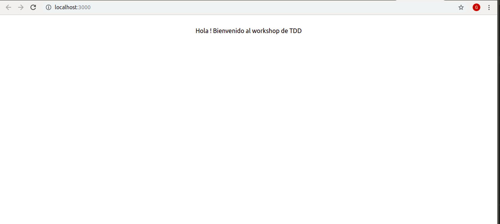

# TDD workshop quick start
Proyecto base para el workshop de tdd.
## Prequisitos
Tener instalado lo siguiente
* Node (version lts)
* Git 

## Como empezar

1) Clonamos el repo
```bash
git clone https://github.com/Guusy/tdd-workshop-quickstart.git
```
2) Instalamos las dependencias
```bash
npm install
```

3) Corremos el proyecto para verificar que levante todo ok
```bash
npm run start
```
En tu navegador por defecto se abrira [http://localhost:3000](http://localhost:3000/)

Y veras lo siguiente : 




